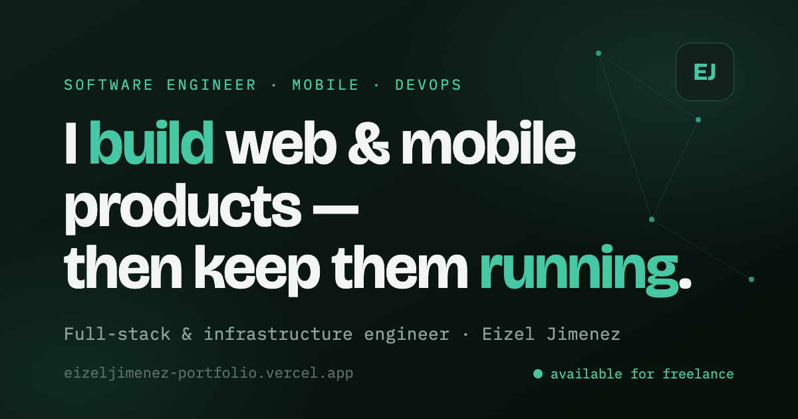

# Eizel Jimenez — Portfolio

**Live: [eizeljimenez-portfolio.vercel.app](https://eizeljimenez-portfolio.vercel.app/)**



A single-page portfolio built with **React 18 + Vite 5**. Hand-built components, plain CSS,
zero UI libraries — every animation and interaction below is written from scratch.

## Features

- 🖥️ **Terminal boot sequence** on first load
- ✨ **Particle network** hero background (Canvas API, mouse-reactive)
- 🌗 **Dark mode** — persisted in localStorage, restored before first paint (no flash)
- 📊 **Animated skill radar chart** (hand-rolled SVG, draws on scroll into view)
- 🔍 **Stack filter** — click any tech chip to highlight matching projects
- ⚡ **Deploy easter egg** — a FAB that runs a mock CI/CD pipeline (build → test → push → deploy → live)
- 🏆 **Achievement toast** when you reach the bottom of the page
- 🖱️ Cursor trail, 3D card tilt, count-up stats, typewriter effect, scroll progress bar
- ♿ Respects `prefers-reduced-motion` — all effects degrade gracefully
- 📱 Fully responsive down to 375px

## Tech

React 18 · Vite 5 · vanilla CSS (custom properties for theming) · Canvas API · SVG ·
IntersectionObserver · requestAnimationFrame · no runtime dependencies beyond React

## Run it locally

```bash
npm install      # install dependencies
npm run dev      # start the dev server (http://localhost:5173)
npm run build    # production build → /dist
```

## Structure

```
src/
  data.js              # all page content (edit copy here)
  index.css            # design tokens + all styles
  App.jsx              # composes the sections
  components/
    common.jsx         # Nav (theme toggle, scroll progress), Footer, Reveal
    Hero.jsx           # hero + live status panel + particle canvas
    Stats.jsx          # animated count-up strip
    About.jsx          # intro + story
    BuildRun.jsx       # "Build & Run" two-column
    Work.jsx           # project cards with 3D tilt + filtering
    Toolkit.jsx        # tech chips (click to filter work)
    RadarChart.jsx     # animated SVG skill radar
    Approach.jsx       # principles
    Contact.jsx        # CTA, copy-email button
    BootScreen.jsx     # terminal boot animation
    DeployModal.jsx    # mock CI/CD pipeline easter egg
    ParticleCanvas.jsx # hero particle network
    CursorTrail.jsx    # cursor dots
    AchievementToast.jsx
```

Deployed on [Vercel](https://vercel.com) — auto-deploys on every push to `main`.
